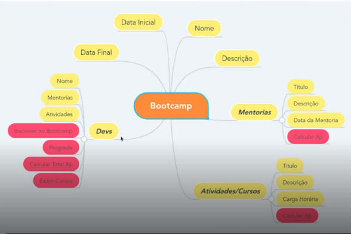

# Desafio: Abstraindo um Bootcamp Usando Orientação a Objetos em Java

Este projeto foi desenvolvido como parte do curso de Java & AWS na DIO. O objetivo principal é aplicar os pilares da Programação Orientada a Objetos (POO) em um cenário real: o funcionamento de um Bootcamp de tecnologia.

## 🎯 Objetivos do Projeto
* Praticar os pilares da POO: **Abstração, Herança, Encapsulamento e Polimorfismo**.
* Manipular coleções em Java utilizando o framework `Collections` (Set, LinkedHashSet).
* Desenvolver lógica de negócio para inscrição de alunos, progressão em cursos e cálculo de XP.

## 🏗️ Estrutura de Classes (Mapa Mental)
Para o planejamento deste projeto, utilizei a seguinte estrutura lógica:



## 🛠️ Tecnologias Utilizadas
* **Linguagem:** Java 21
* **IDE:** IntelliJ IDEA
* **Versionamento:** Git & GitHub

## 📝 Conceitos Aplicados
* **Abstração:** Criação da classe abstrata `Conteudo`, servindo de base para cursos e mentorias.
* **Herança:** `Curso` e `Mentoria` herdam atributos e métodos comuns de `Conteudo`.
* **Polimorfismo:** Implementação do método `calcularXp()` com regras diferentes para cada tipo de conteúdo.
* **Encapsulamento:** Uso de modificadores de acesso `private` e métodos `getters/setters` para proteção de dados.

## 🚀 Como Executar
1. Clone o repositório:
   ```bash
   git clone [https://github.com/JoaoVictordePaulaSilva/Desafio-DIO-Bootcamp.git](https://github.com/JoaoVictordePaulaSilva/Desafio-DIO-Bootcamp.git)